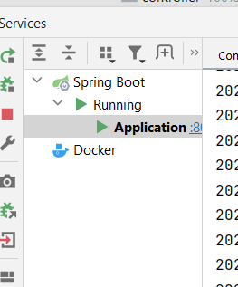

Demo application about book ordering
To run application in intellij ide after project is buid application could be run

For docker after mvn clean package is run docker file can be run with following configuration

Postman apis are provided:

auth access api should be called and then access_token and refresh_token variables will be set on collecion level

insert book can be used to insert books (body is ready in collection)

insert customer can be used to insert customer customer_id variable will be set from response

insert order can be used after books and customer are created customer_id will be ready on request body ids inside book 
should be set according to inserted book ids (ids can be seen insert book response after inserted or from get book api all books can be fetched)
after datas are created by insertion apis put and get apis can be called according to inserted data
